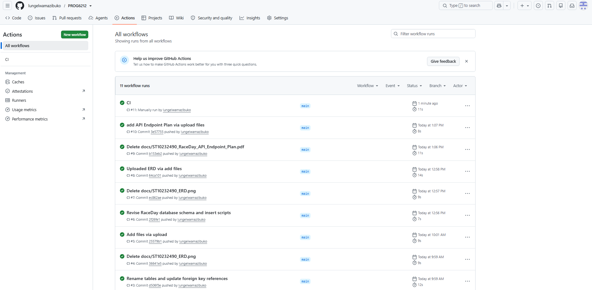

# RaceDay – Event Management System

**Student Number:** ST10232490  
**Student:** Lungelwa S'phesihle Mazibuko  
**Module:** PROG6212  
**Project:** RaceDay Event Management System  

## System Description

RaceDay is a full-stack web-based event management system developed for the South African road-running, walking, and cycling community.

The system allows organisers to create and manage events, categories, participant enrolments, and race results. Participants can register for an account, browse available events, enter events, and track their results. Administrators oversee overall race-day operations, user management, registrations, timing, results, and system activities.

The project is developed progressively across three parts:

- **Part 1:** System planning and database design
- **Part 2:** RESTful API development
- **Part 3:** ASP.NET Core MVC web application development

## User Roles

### Organiser

Organisers are responsible for managing event-related activities. They can:

- Create, edit, and delete events
- Create and manage event categories
- View participant enrolments
- Capture participant results
- View participant results
- Manage event information and race details

### Participant

Participants can use the system to:

- Create and manage an account
- Browse available events
- View event details and categories
- Enter events by selecting a category
- View their event enrolments
- Track their personal race results

### Administrator

Administrators oversee the overall operation of the RaceDay system. They can:

- Manage users and system access
- Oversee events, registrations, and participant information
- Monitor race-day operations
- Coordinate with organisers, officials, volunteers, and vendors
- Manage timing systems and race results
- Review post-race reports
- Resolve operational and system-related issues

Role-based access control is enforced at the API level in Part 2 and implemented consistently in the MVC application in Part 3.

## Project Parts

### Part 1 – System Planning

Part 1 focuses on planning and database design.

Deliverables include:

- Entity Relationship Diagram (ERD)
- Complete API endpoint plan
- SQL database creation script
- Database design supporting Organiser, Participant, and Administrator roles
- System requirements and planning documentation

No API code is developed in Part 1.

### Part 2 – RESTful API

Part 2 implements the backend RESTful API.

Features include:

- C# RESTful API
- SQL Server database connectivity
- Entity Framework Core integration
- Required CRUD functionality
- Authentication and role-based authorisation
- Unit tests
- GitHub Actions CI/CD workflow
- Successful automated build and test execution

### Part 3 – MVC Web Application

Part 3 implements the user-facing web application.

Features include:

- ASP.NET Core MVC application
- REST API integration
- Organiser interface
- Participant interface
- Administrator functionality
- Role-based access control
- Azure Blob Storage integration
- Docker containerisation

## Technologies

- C#
- ASP.NET Core RESTful API
- ASP.NET Core MVC
- SQL Server
- Entity Framework Core
- Git
- GitHub
- GitHub Actions
- Azure Blob Storage
- Docker
- HTML5
- CSS3
- JavaScript

## Setup Instructions

### Database Setup

1. Install SQL Server and SQL Server Management Studio.
2. Open the SQL database script from Part 1.
3. Execute the script to create the RaceDay database and tables.
4. Confirm that the database was created successfully.
5. Configure the API connection string.

Example configuration:

```json
{
  "ConnectionStrings": {
    "DefaultConnection": "Server=localhost;Database=RaceDayDB;Trusted_Connection=True;TrustServerCertificate=True;"
  }
}
```

### API Setup

From the API project directory, run:

```bash
dotnet restore
dotnet build
dotnet test
dotnet run
```

Confirm that the API can connect successfully to the database before starting the MVC application.

### MVC Application Setup

1. Start the RESTful API.
2. Configure the MVC application with the API base URL.
3. Configure authentication settings.
4. Configure Azure Blob Storage where required.
5. Build and run the MVC application.
6. Test the Organiser, Participant, and Administrator functionality.

### Azure Blob Storage

Configure Azure Storage settings using local configuration, user secrets, environment variables, or GitHub Secrets.

```json
{
  "AzureBlobStorage": {
    "ConnectionString": "YOUR_AZURE_STORAGE_CONNECTION_STRING",
    "ContainerName": "YOUR_CONTAINER_NAME"
  }
}
```

> Do not commit real credentials, connection strings, passwords, or secrets to GitHub.

### Docker

Build the application image:

```bash
docker build -t raceday .
```

Run the Docker container:

```bash
docker run -p 8080:8080 raceday
```

## GitHub Actions CI/CD

The GitHub Actions workflow is stored in:

```text
.github/workflows/
```

The workflow automatically:

1. Restores the project dependencies
2. Builds the application
3. Runs the automated tests
4. Reports the build and test status

The final repository must show a successful green check mark for the CI/CD workflow before submission.

### Successful CI/CD Build

The following screenshot shows the successful GitHub Actions CI/CD build:



> Save the screenshot as `docs/images/ci-cd-green-build.png`, or update the image path above.

## GitHub Version Control

A minimum of 20 meaningful commits is required for each project part.

Meaningful commits should represent actual development progress. Examples include:

```text
Create event database tables
Add participant registration endpoint
Implement organiser authorisation
Add event category service
Create event enrolment tests
Add GitHub Actions workflow
Implement MVC event listing
Add Azure Blob image upload
Add Docker configuration
```

Commits such as `fixed typo` or `updated file` should not be relied upon to meet the commit requirement unless they represent a meaningful project change.

## Video Presentations

A video presentation is required for each project part. Each video must demonstrate the relevant work and explain:

- System functionality
- Code structure
- Application logic
- Database and API design decisions
- Role-based functionality
- Relevant testing and deployment features

Videos must be uploaded to YouTube as **unlisted videos**. AI-generated voices are not permitted.

### Part 1 – System Planning

YouTube: `ADD_PART_1_UNLISTED_YOUTUBE_LINK_HERE`

### Part 2 – RESTful API

YouTube: `ADD_PART_2_UNLISTED_YOUTUBE_LINK_HERE`

### Part 3 – MVC Web Application

YouTube: `ADD_PART_3_UNLISTED_YOUTUBE_LINK_HERE`

## Testing

Run the unit tests using:

```bash
dotnet test
```

Tests should cover:

- API functionality
- CRUD operations
- Input validation
- Authentication
- Role-based authorisation
- Participant enrolments
- Event categories
- Race results

## Project Structure

```text
RaceDay/
│
├── Part1/
│   └── docs/
│       ├── ERD/
│       ├── API-Plan/
│       └── Database/
│
├── Part2/
│   ├── RaceDay.API/
│   ├── RaceDay.Tests/
│   └── .github/
│       └── workflows/
│
├── Part3/
│   ├── RaceDay.MVC/
│   └── Docker/
│
├── docs/
│   └── images/
│       └── ci-cd-green-build.png
│
├── README.md
└── ...
```

## Project Status

| Part | Description | Status |
| :--- | :--- | :--- |
| Part 1 | ERD, API endpoint plan, and SQL database | Completed |
| Part 2 | C# RESTful API, database connection, unit tests, and CI/CD | Pending |
| Part 3 | MVC application, Azure Blob Storage, and Docker | Pending |

## Author

**Student:** Lungelwa S'phesihle Mazibuko  
**Student Number:** ST10232490  
**Module:** PROG6212  
**Project:** RaceDay Event Management System
